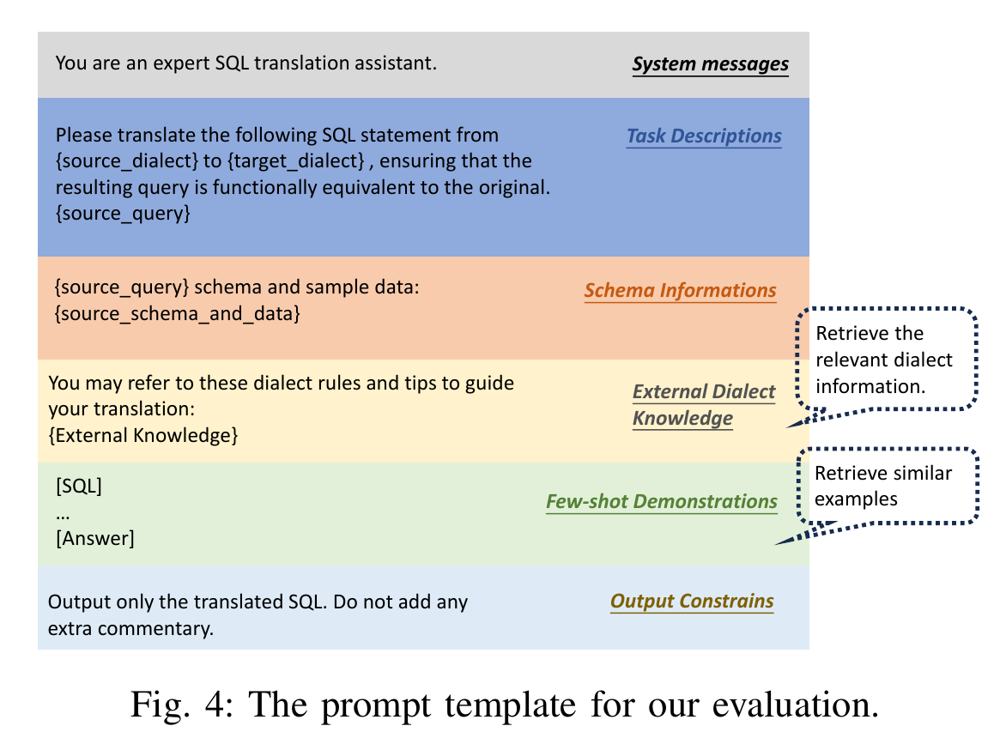

# 一、 数据集格式说明
数据集文件命名为：`bird-<dbms>.json`，是以json格式存储的列表
**单条样本示例如下：**
```json
{
        "sql_id": 1,
        "database_name": "movie_platform",
        "source_dialect": "sqlite",
        "target_dialect": "mysql",
        "source_query": "SELECT movie_title, movie_release_year FROM movies ORDER BY LENGTH(movie_popularity) DESC LIMIT 1",
        "target_query": "SELECT `movie_title`, `movie_release_year` FROM `movies` ORDER BY LENGTH(`movie_popularity`) DESC LIMIT 1;",
        "semantic_equivalent_type": "exact_equivalence",
        "source_dialect_locations": [
            {
                "start_index": 60,
                "end_index": 83,
                "dilatect_content": "LENGTH(movie_popularity)",
                "feature": "length(X)"
            }
        ],
        "target_dialect_locations": [
            {
                "start_index": 66,
                "end_index": 91,
                "dilatect_content": "LENGTH(`movie_popularity`)",
                "feature": "LENGTH(str)"
            }
        ],
        "source_dialect_knowledge": [
            {
                "feature": "length(X)",
                "explanation": "For a string value X, the length(X) function returns the number of \n  Unicode code points (not bytes) in input string X prior to the first U+0000\n  character.\n  Since SQLite strings do not normally contain NUL characters, the length(X)\n  function will usually return the total number of characters in the string X.\n  For a blob value X, length(X) returns the number of bytes in the blob.\n  If X is NULL then length(X) is NULL.\n  If X is numeric then length(X) returns the length of a string\n  representation of X.\n  \n  Note that for strings, the length(X) function returns the character\n  or code-point\n  length of the string, not the byte length.  The character length is the number\n  of characters in the string.  The character length is always different from\n  the byte length for UTF-16 strings, and can be different from the byte length\n  for UTF-8 strings if the string contains multi-byte characters.  Use the\n  octet_length() function to find the byte length of a string.\n  \n  For BLOB values, length(X) always returns the byte-length of the BLOB.\n  \n  For string values, length(X) must read the entire string into memory in order\n  to compute the character length.  But for BLOB values, reading the whole string\n  into memory is not necessary as SQLite already\n  knows how many bytes are in the BLOB.  Hence, for multi-megabyte values,\n  the length(X) function is usually much faster for BLOBs than for strings, since\n  it does not need to load the value into memory.\n",
                "examples": [
                    "SELECT length('Hello'); -- Returns 5",
                    "SELECT length(X'68656C6C6F'); -- Returns 5 (Hexadecimal BLOB)"
                ]
            }
        ],
        "target_dialect_knowledge": [
            {
                "feature": "LENGTH(str)",
                "explanation": "LENGTH(str) returns the length of the string  str, measured in bytes. A multibyte  character counts as multiple bytes. This means that for a  string containing five 2-byte characters,  LENGTH() returns  10, whereas  CHAR_LENGTH() returns  5. Returns NULL if  str is NULL. Note: The Length() OpenGIS spatial function is named ST_Length() in MySQL.",
                "examples": [
                    "SELECT LENGTH('text'); -- Returns 4."
                ]
            }
        ],
        "target_related_schemas": [
            "Table: `movies`\nColumns:\n(`movie_id`, BIGINT, primary key)\n(`movie_title`, TEXT)\n(`movie_release_year`, BIGINT)\n(`movie_url`, TEXT)\n(`movie_title_language`, TEXT)\n(`movie_popularity`, BIGINT)\n(`movie_image_url`, TEXT)\n(`director_id`, TEXT)\n(`director_name`, TEXT)\n(`director_url`, TEXT)\n"
        ]
    }
```
**关键字段说明：**
1. `source_query`是来自BIRD的原SQL语句，是大模型要转换的对象
2. `target_query`是Ground-Truth，表示大模型预期转换的结果
3. `source_dialect_locations`：`source_query`中方言信息的位置，先用不到
4. `target_dialect_locations`：`target_query`中方言信息的位置，先用不到
5. `source_dialect_knowledge`：`source_query`中的方言Token的额外信息
6. `target_dialect_knowledge`：`target_query`中与`source_query`对应的方言Token的额外信息
7. `target_related_schemas`：目标DBMS下的表结构信息

# 二、 实验说明
## 1. 部署大模型
这里需要用实验室的21服务器来部署一下4个大模型（SQLCoder-7B，CodeLlama-7B-Instruct，Deepseek-Coder-6.7B-Instruct和DeepSeek-R1-Distill-Llama-8B），需要：
1. 先找超哥要一下登录21服务器的账号
2. 21服务器要求用docker来开发，也就是要在docker里面部署大模型+写代码，推荐用VS-Code（提供免费的远程开发服务，可以直接访问远程服务器的docker容器内部的文件）
3. 部署大模型需要先下载模型文件，huggingface大概率被墙了，可以找下镜像站（我之前用的：https://hf-mirror.com/）
4. 我之前部署大模型的参考：https://www.yuque.com/u37019800/gggcw2/ez9t0oappq8p0m2o?singleDoc#

## 2. 按照论文要求，生成预测的SQL语句
> 这里评估代码我还没想好具体咋实现（可能用ANTLR来搞），先调用大模型生成预测的SQL语句，暂不进行评估

论文里一共要求用三种方式来运行大模型：
1. Prompt Only (PO)
2. Few-shot (FS)
3. With External Knowledge (EK)

学长说先测PO的，他提供的提示词如下图所示：


现在就是用PO和我所提供的数据集（主要用到：`source_dialect`，`target_dialect`，`source_query`，`source_related_schemas`，`target_related_schemas`，为每条样本生成对应的预测SQL语句

> `source_related_schemas`我晚点补一下